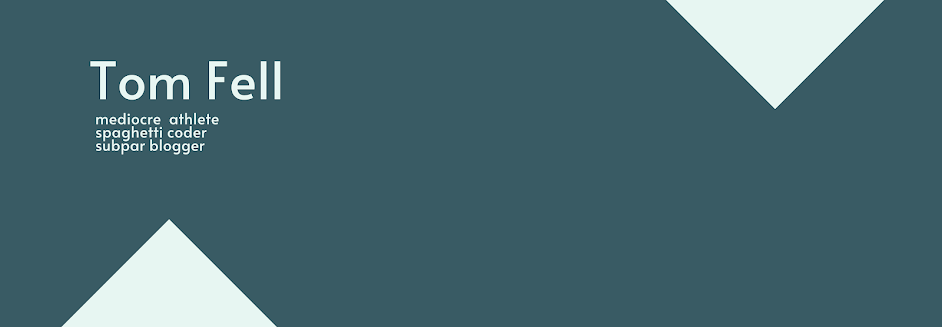

<h2 align="center">
Hello There! I'm Tom :wave:
</h2>
<h3 align="center">
I'm learning to be a full-stack dev :computer: whilst attempting to blog the rest of what I get up to :green_book:
</h3> 
<h3 align = "left">
Connect with me: 
<h3 align="left">

 
<h2>
Currently Listening to: 

<h2>
:city_sunset: Currently working on:
</h2>
:hammer: building my first website using React  
:orange_book: getting my blog up and running 
